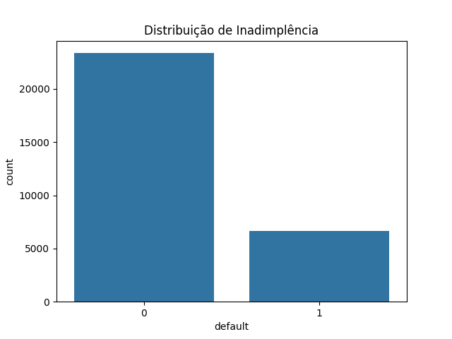
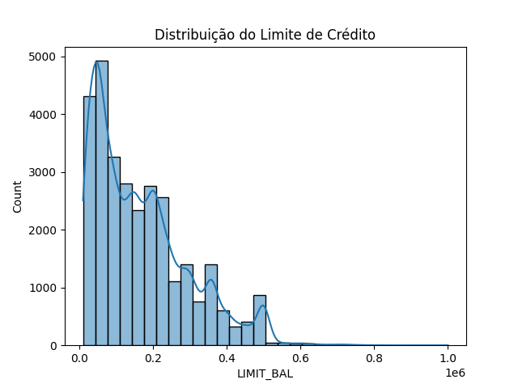
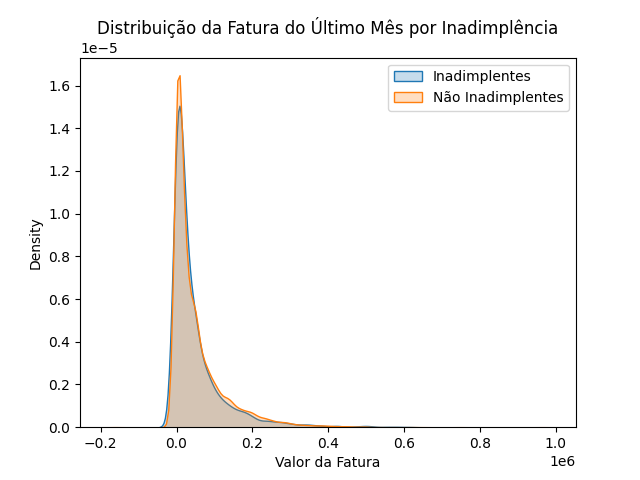
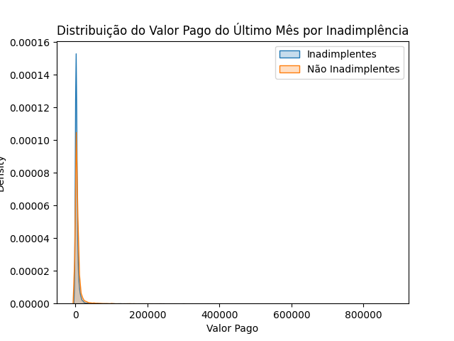
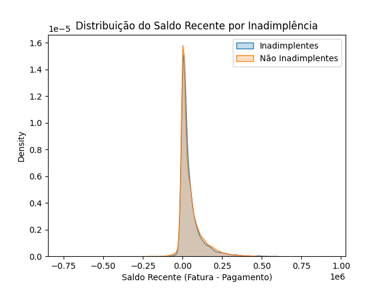
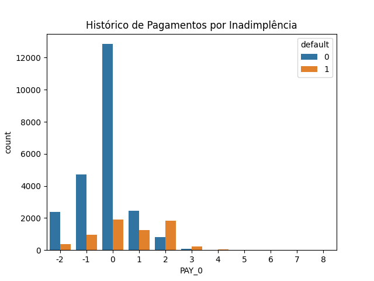

# 📊 Análise de Risco de Crédito

Este projeto tem como objetivo analisar dados de clientes para identificar padrões de inadimplência e desenvolver um modelo de machine learning capaz de prever risco de default.

A análise combina exploração de dados, engenharia de variáveis e modelagem preditiva.

---

# 🎯 Objetivo do Projeto

Identificar fatores associados ao risco de inadimplência e construir um modelo capaz de prever clientes com maior probabilidade de default.

Esse tipo de análise pode apoiar instituições financeiras em decisões de concessão de crédito e gestão de risco.

---

# 🛠️ Tecnologias Utilizadas

- Python
- Pandas
- NumPy
- Matplotlib
- Seaborn
- Scikit-learn
- Jupyter Notebook

---

# 📁 Estrutura do Projeto

analise-risco-credito
│
├── data
├── imagens
├── notebooks
│ ├── EDA_risco_de_credito.ipynb
│ ├── base_tratada.ipynb
│ ├── Feature_engineering.ipynb
│ ├── Modelagem_e_Avaliacao.ipynb
│ └── Previsao_Novos_Defaults.ipynb

---

# 🔎 Análise Exploratória (EDA)

Foram analisadas distribuições de variáveis relevantes relacionadas ao comportamento financeiro dos clientes.

## Distribuição de Inadimplência

## Limite de Crédito vs Inadimplência

## Fatura e Inadimplência

## Pagamentos e Inadimplência

## Saldo Recente

## Histórico de Pagamentos

---

# 🤖 Modelagem Preditiva

Foi utilizado um modelo de *Random Forest* para prever a probabilidade de inadimplência.

Etapas realizadas:

1. Tratamento de dados
2. Engenharia de variáveis
3. Divisão treino/teste
4. Treinamento do modelo
5. Avaliação de performance

---

# 📈 Resultados

O modelo demonstrou capacidade de identificar padrões relevantes associados ao risco de crédito, permitindo prever potenciais clientes inadimplentes.

---

# 👨‍💻 Autor

Murillo Bernardes
